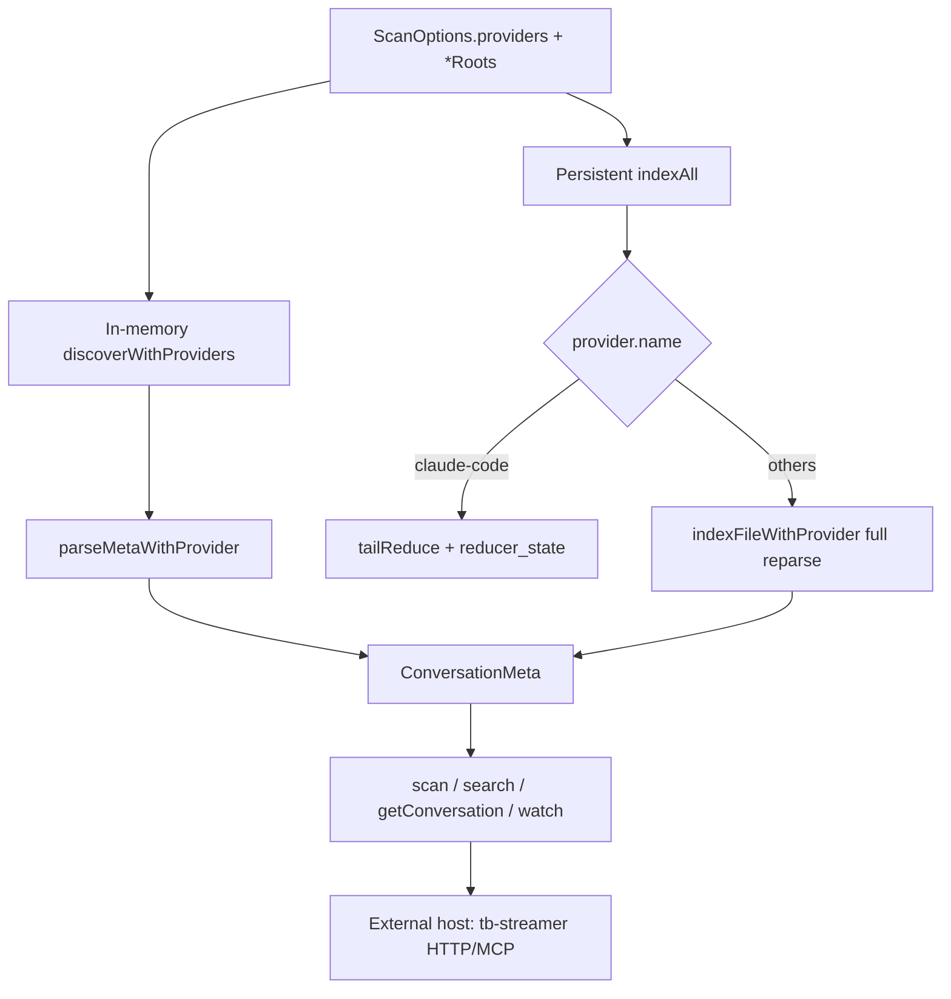

# Multi-agent session history — feasibility

**Status:** research / roadmap (no implementation yet)
**Date:** 2026-07-24
**Question:** Can `@threadbase-sh/scanner` scan (and “serve”) session history from Cursor, Amp, Antigravity, Copilot, OpenCode, Gemini, Grok, and similar agents?

## Short answer

| Capability | Verdict |
|---|---|
| **Scan / index / search** | **Yes, for most agents** — extend the existing `ScannerProvider` pipeline (Claude Code + Codex CLI already prove the pattern). Each agent needs its own discover + reduce + full-conversation parse, opt-in via `providers` + explicit roots (no default home scan). |
| **Serve over HTTP / MCP inside this package** | **No (by design).** This package stays a library + CLI. HTTP/SSE/MCP belongs in an external host (e.g. `tb-streamer`). The scanner already exposes `scan` / `search` / `getConversation` / `getConversationPage` / `watch()` for such a host to wrap. |

Formats vary widely (append-only JSONL, whole-file JSON rewrite, SQLite, VS Code `state.vscdb`, protobuf). Difficulty is format-shaped, not architecture-shaped.

---

## What already exists

Today the scanner indexes two local formats through one normalized model:

- **`claude-code`** (default) — `~/.claude/projects/**/*.jsonl`, byte-offset incremental fold into SQLite
- **`codex-cli`** (opt-in) — absolute `codexRoots`, full reparse on change (sessions are small)

Key pieces to reuse for every new agent:

- [`src/providers/provider.ts`](../../src/providers/provider.ts) — `ScannerProvider` (`discover` / `canParse` / `createEmptyAccumulator` / `reduceEntry` / `finalize`)
- [`src/providers/codex-cli.ts`](../../src/providers/codex-cli.ts) — template for a non-Threadbase provider + `parseCodexConversation`
- [`src/providers/parse.ts`](../../src/providers/parse.ts) — shared stream fold
- Persistent dispatch in [`src/persistent/index-engine.ts`](../../src/persistent/index-engine.ts) — non-`claude-code` providers take the full-reparse `indexFileWithProvider` path (schema `provider` column, FTS, `(provider, path)` identity)

Wiring every new provider touches the same call sites Codex already touched: `ProviderName` unions, `discoverWithProviders`, `indexAll`, `resolveProviderForFile`, `getConversation` / `getPage`, fixtures under `__fixtures__/<provider>/`, and mirrored in-memory + persistent tests.

---

## “Serve” — out of scope for this package

From [`docs/plans/jsonl-conversation-index-spec.md`](./jsonl-conversation-index-spec.md):

> Do not put Fastify inside `@threadbase-sh/scanner` itself.
> … scanner package should remain a framework-agnostic library.

Non-goals already recorded for the scanner: built-in HTTP, WebSocket/SSE, MCP server.

**Serving path:** keep indexing here; wrap the library in `tb-streamer` (or another host) that exposes e.g. `GET /conversations`, `GET /conversations/:id`, `GET /events`. Once a provider lands in the scanner, the host gets it for free via `providers` / `*Roots` options — no per-agent HTTP work in this repo.

---

## Feasibility matrix

Difficulty scale for a Codex-shaped provider (discover + meta fold + full parse + tests):

- **Easy** — JSONL or single JSON files, documented layout, stable field names
- **Medium** — SQLite or dual legacy/current formats; still structured text/JSON
- **Hard** — VS Code–style opaque SQLite KV with version drift, or binary protobuf

| Agent | Local store (typical) | Format | Scan? | Difficulty | Notes |
|---|---|---|---|---|---|
| **Gemini CLI** | `~/.gemini/tmp/<project_hash>/chats/session-*.jsonl` (+ legacy `.json`) | Append-only JSONL (metadata line + messages) | Yes | Easy | Closest to Codex/Claude. Env override: `GEMINI_DIR`. |
| **Grok CLI** | `~/.grok/sessions/<cwd-encoded>/<sessionId>/` | Dir per session: `summary.json` + `updates.jsonl` / `chat_history.jsonl` | Yes | Easy–Medium | Authoritative transcript is `updates.jsonl` (ACP stream). `GROK_HOME` override. Discovery is directory-based, not single-file — map one session dir → one `ConversationMeta` (`id` = canonical session path). |
| **Amp** | `~/.local/share/amp/threads/T-{uuid}.json` | Whole-file JSON rewrite (`messages[]`, usage ledger) | Yes | Easy | No append-only Δ; always full reparse (same as Codex path). Prefer threads over `history.jsonl` (prompts only). |
| **Copilot CLI** | `~/.copilot/session-state/<id>/events.jsonl` + `session-store.db` | JSONL events (+ Chronicle SQLite index) | Yes | Medium | Prefer `events.jsonl` for full transcript; Chronicle is a subset for listing. `COPILOT_HOME` override. |
| **Cursor Agent transcripts** | `~/.cursor/projects/<slug>/agent-transcripts/<runId>/<runId>.jsonl` | JSONL | Yes | Easy–Medium | Best Cursor entry point — file-shaped like Codex. Distinct from Composer chat. |
| **Cursor Composer** | `Cursor/User/globalStorage/state.vscdb` (+ workspace DBs) | SQLite `cursorDiskKV` / `ItemTable` (`composerData:…`, `bubbleId:…`) | Yes | Hard | Schema drift (≤2.6 per-workspace `allComposers` vs 3.0+ central `composer.composerHeaders`). Read-only; copy DB if locked. Not a natural fit for JSONL providers — needs a SQLite-backed provider variant. |
| **OpenCode** | `~/.local/share/opencode/opencode.db` (+ legacy `storage/session|message|part`) | SQLite `session` / `message` / `part`; legacy JSON tree | Yes | Medium | Prefer SQLite when present; drop legacy to avoid double-count. macOS: `~/Library/Application Support/opencode/`. |
| **Copilot (VS Code Chat)** | `Code/User/workspaceStorage/<hash>/chatSessions/*.json` | Per-workspace JSON sessions | Yes | Medium | Must resolve workspace hash → folder via `workspace.json`. Separate from Copilot CLI. |
| **Antigravity** | `~/.gemini/antigravity/conversations/*.pb` + `Antigravity/.../state.vscdb` index | **Protobuf** transcripts + SQLite UI index | Partial / Hard | Hard | `.pb` is opaque without a maintained proto or reverse-engineered decoder. Index alone is titles/ids, not full messages. Lowest ROI until a stable decoder exists. |
| **Other agents** (OpenClaw, Goose, Qwen, Cline/Roo, Factory Droid, …) | Various (`~/.openclaw`, Goose SQLite, etc.) | Mixed | Case-by-case | — | Same provider pattern; add when a consumer needs them. |

All roots should stay **opt-in and absolute** (Codex precedent: never silently scan `$HOME`).

---

## Architecture implications

### Provider shape (unchanged contract)

Each new agent implements `ScannerProvider` plus, when the on-disk format is not Threadbase JSONL, a `parseXConversation(filePath, account)` used by `getConversation` / `getConversationPage` (mirror Codex).

### Gaps to close as providers multiply

1. **Registry** — today Codex is hard-wired in `scanner.ts` / `index-engine.ts`. A small `providers` registry (name → factory + optional roots key) avoids N-way `if` growth.
2. **Non-file identities** — Grok sessions are directories; OpenCode/Cursor Composer are DB rows. Keep `ConversationMeta.id` as a stable absolute path-like key (`…/sessionId` or `sqlite://opencode.db#session/<id>` convention — pick one and document). Prefer real filesystem paths when a primary artifact exists.
3. **SQLite / protobuf providers** — either:
   - extend `ScannerProvider` with an optional `discoverFromStore()` that yields virtual files / blobs, or
   - keep “file providers” only and add a parallel `StoreProvider` used only by persistent `indexAll`. Prefer the smallest extension that preserves Codex’s full-reparse path for v1 of each agent.
4. **CLI** — library already accepts `providers` / `codexRoots`; CLI has no flags yet. Add `--providers` and `--*-roots` when the first new consumer needs them.
5. **Schema** — `provider TEXT` already exists (v3+). New names are additive string values; no migration required beyond documenting allowed `ProviderName`s.

### Incremental indexing

Default new providers to **full reparse on change** (Codex path) unless the format is append-only JSONL *and* the accumulator is serializable. Amp (whole-file rewrite) and SQLite stores should never pretend to be byte-cursor resumable.

---

## Recommended phased roadmap

### Phase 0 — Hygiene (this doc)

- Record feasibility + “serve elsewhere” decision.
- Optionally refresh README Codex “in-memory only” warning (stale vs `persistent-codex.test.ts`) in a follow-up.

### Phase 1 — JSONL / file agents (highest ROI)

Ship one provider at a time, Codex template, persistent + in-memory tests:

1. **Gemini CLI** (`gemini-cli`)
2. **Cursor agent-transcripts** (`cursor-agent`) — not Composer
3. **Grok CLI** (`grok-cli`) — session-dir discovery
4. **Amp** (`amp`)
5. **Copilot CLI** (`copilot-cli`) — `events.jsonl`

Each PR: provider module, fixtures, unit + `persistent-*-.test.ts`, wire discovery/sniff/getConversation/getPage, extend `ProviderName`.

### Phase 2 — SQLite store providers

6. **OpenCode** (`opencode`)
7. **Copilot VS Code Chat** (`copilot-vscode`) if still needed after CLI

Introduce a thin store-discovery helper; still upsert into the same `conversations` / FTS tables.

### Phase 3 — Hard / optional

8. **Cursor Composer** (`cursor-composer`) — behind a feature flag; pin supported Cursor major versions; document 2.6 vs 3.0 index locations.
9. **Antigravity** — only if a maintained `.pb` decoder appears; otherwise skip full-message indexing.

### Serving (separate repo)

- Wire new `providers` / roots through `tb-streamer` (or equivalent) once Phase 1 lands.
- Do not add Express/Fastify/MCP to `@threadbase-sh/scanner`.

---

## Implementation checklist (per provider)

Mirror Codex (`__tests__/codex-provider.test.ts`, `__tests__/persistent-codex.test.ts`):

1. Extend `ProviderName` / `ScannerProviderName` + constant.
2. Implement `discover` / `canParse` / accumulator / `reduceEntry` / `finalize`.
3. Implement `parseXConversation` if format ≠ Threadbase.
4. Wire `discoverWithProviders`, `indexAll`, `resolveProviderForFile`, get-conversation/page paths.
5. Add `__fixtures__/<provider>/` real samples (anonymized).
6. In-memory + persistent integration tests; deletion + refresh; search `provider` filter.
7. Document opt-in roots in README (absolute paths; no home default).

---

## Risks

- **Schema drift** — Cursor Composer and Antigravity change storage without notice; pin versions in tests and sniff defensively.
- **Locked DBs** — VS Code/`state.vscdb` may be locked while the IDE runs; open read-only or copy-on-read.
- **Privacy** — scanning more agents means more local PII in the index DB; keep roots opt-in.
- **Double counting** — OpenCode SQLite vs legacy JSON; Cursor agent-transcripts vs Composer; Copilot CLI vs VS Code Chat — document mutual exclusivity / preference rules.
- **Identity collisions** — continue non-unique `sessionId`, newest-timestamp-first; canonical id remains path (or documented store key).

---

## Conclusion

Scanning these agents is **architecturally already supported**; the work is per-format providers, not a new scanner. Serving is **already designed as an external host** wrapping this library — do not fold an HTTP/MCP server into the package.

Best next implementation step: **Phase 1 Gemini CLI** (or Cursor agent-transcripts if product priority prefers Cursor), using `CodexCliProvider` as the template.
